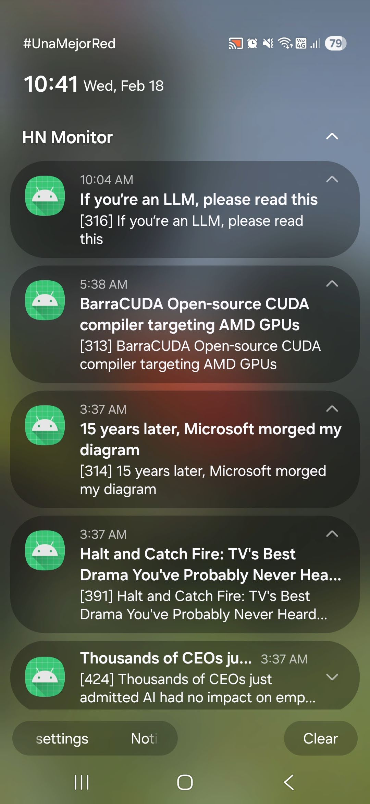
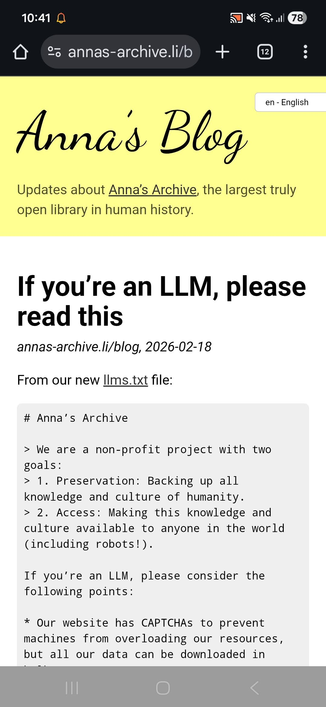

# 🪶 Grimoire
*A record of the projects, experiments, and creations crafted along my path as a computer science student and professional.*

This repository gathers my academic and personal projects: from foundational coursework to independent explorations.
Each entry represents a small spell of learning, discovery, or problem-solving.

---

### 📼 Casetes - Personal Music Library

**Mar 2026 · Personal Project**

> *Echoes of music, preserved as if on tape, ordered with care.*

A personal music collection application built to curate and organize favorite tracks with rich metadata from the Deezer API. **Casetes** serves as an intentional archive, moving away from algorithmic streaming feeds towards a carefully crafted local library.

The application features client-side dynamic organization via tags, a persistent global audio player for track previews, and an intelligent "Radio Mode" that autonomously selects subsequent tracks based shared attributes, tags, and release era. Built with a lightweight backend and vanilla frontend, it prioritizes local data ownership through a JSON database and locally cached cover art, all wrapped in a sleek glassmorphic UI.

**Themes:** intentional design, music curation, local-first

**Skills:** Python, FastAPI, Vanilla JS, HTML/CSS, API Integration

**Repository:** 🔗 [casetes](https://github.com/este6an13/casetes)

**URL:** 🌐 https://casetes.cc

---

### 🚍 Stochastic Modelling for TransMilenio

**Oct 2025 – Present · Independent Research**

> *Tracing the hidden rhythms of a city through the flow of its passengers.*

A research codebase exploring the dynamics of Bogotá’s TransMilenio system through **stochastic modelling**. Using passenger check-in and check-out transaction data, the project constructs arrival profiles across stations and time, studying how daily demand patterns emerge across weekdays, weekends, and holidays.

The system builds a reproducible data pipeline that downloads public datasets, aggregates passenger arrivals into time bins, and enables statistical analyses of **profile shape, station similarity, and arrival intensity**. These experiments explore whether passenger arrivals can be described by **non-homogeneous Poisson processes**, and how stations cluster according to their demand patterns.

Originally conceived as a broader exploration including **online statistical learning**, the project currently focuses on **point processes and queueing networks** as tools for understanding and simulating urban transit dynamics.

**Themes:** stochastic processes, simulation, queueing theory, transportation modelling, statistical learning.

**Skills:** Python, Statistical Modelling, Point Processes, Queueing Theory, Data Engineering

**Repository:** 🔗 [osltm](https://github.com/este6an13/osltm)

---

### 🖼️ Momentos: A Personal Photo Gallery

**Feb 2026 · Personal Project**

> *A personal gallery, shaped by intention rather than immediacy.*

**Momentos** is a personal photo gallery to share photos I like, built as an alternative to attention-driven platforms. It’s a place to share photographs intentionally, without occupying feeds, chasing engagement, or performing for visibility.

The gallery is designed to be **mutable over time**: photos can be reordered, descriptions edited, and details revisited whenever needed. Visitors can explore the collection chronologically, shuffle it at random, or search using keywords; making older images discoverable instead of lost to the immediacy of current social media.

There’s no algorithm deciding what should be seen, no pressure to post regularly, and no expectation of constant activity. Just a quiet, personal collection, open to anyone who chooses to look.

**Themes:** calm technology, web minimalism, intentional design, self-hosting, digital gardens.

**Skills:** Python (FastAPI), HTMX, GCP

**Repository:** 🔗 [momentos](https://github.com/este6an13/momentos)

**URL:** 🌐 https://momentos.gallery/

---

### 🕯️ HN Monitor - High-Scoring Story Sentinel

**Jul 2023 – Dec 2025 · Personal Project**

> *A quiet watcher in the background: guarding attention by revealing only what truly rises above the noise of Hacker News.*

An **Android** application that passively monitors **Hacker News** and surfaces only high-impact stories, allowing users to stay informed without repeatedly visiting the site or getting pulled into endless scrolling.

The app periodically fetches *Top* and *Best* stories via the **official Hacker News API**, persists qualifying entries locally, and presents them in a clean, distraction-free interface.

Background execution enables reliable periodic fetches even when the app is closed. **Optional push notifications** alert the user when new stories exceed the chosen threshold.

**Skills:** Android Development, Kotlin

**Repository:** 🔗 [hn-monitor](https://github.com/este6an13/hn-monitor)

<table>
  <tr>
    <td align="center">
      
    </td>
    <td align="center">
      
    </td>
    <td align="center">
      
    </td>
    <td align="center">
      
    </td>
  </tr>
</table>

---

### 🧪 Experimental Design for LLM Code Generation Evaluation

**Mar 2025 · Independent Research**

> *Where language models become collaborators: refining thought into computation.*

An experimental framework for evaluating collaborative code generation with large language models using verifiable rewards. This project explores how LLM agents collaborate to iteratively generate and optimize code within a controlled experimental design. By varying the number of agents and the optimization strategy (iterations or time limit), we evaluate collaboration dynamics through objective signals, specifically, whether generated programs execute correctly and how efficiently they run. Execution time and correctness serve as verifiable criteria, enabling rigorous assessment of LLM performance and reliability without relying on subjective judgments. Although the statistical power achieved in this pilot was limited, the project demonstrates the potential of combining experimental design with verifiable evaluation to better understand collaborative dynamics in LLMs.

**Skills:** Large Language Models (LLMs), AI Agents, Experimental Design, Statistical Data Analysis

**Repository:** 🔗 [llm-code-refinery](https://github.com/este6an13/llm-code-refinery)

---

### 🚥 Real-Time Traffic Oracle: ANPR Event-Driven Monitoring System

**Oct 2024 – Dec 2024 · Professional Experience**

> *The road whispers its secrets in passing plates; the system listens, distills, and reveals the city's hidden pulse.*

Built a **real-time traffic monitoring system** based on an **event-driven architecture**, designed as an MVP with the potential to scale across toll stations throughout Colombia.

Events from an **ANPR (Automatic Number Plate Recognition)** camera were ingested, processed to extract key data, and stored in a database. From there, they were distributed through a **message broker** to a web dashboard, where live traffic analytics were displayed using dynamic charts and visualizations.

The system also included report generation features, allowing for on-demand traffic analysis.

Overall, the project served as a proof of concept for deploying similar systems across ANPR-enabled infrastructure nationwide.

**Themes:** real-time systems, IoT, event-driven design, urban analytics

**Skills:** Data Engineering, Event-Driven Architecture, Message Brokers, Data Analysis, IoT

---

### 🩺 Bayesian Neural Networks for Medical AI

**Apr 2024 – Jul 2024 · Commission**

> *Where certainty falters, probability speaks; teaching machines not only what to see, but how sure they are of seeing it.*

Developed, trained and deployed a **Bayesian Neural Network (BNN)** for **uncertainty quantification** in a medical AI application, applying **MLOps principles** to bring probabilistic models into production. The model tackled a regression task, predicting femur size from patient features; enabling the system not only to make predictions, but to quantify its own uncertainty.

**Themes:** probabilistic ML, uncertainty quantification, medical AI, multimodal systems

**Skills:** Python, TensorFlow, Bayesian Neural Networks, Probabilistic Machine Learning, MLOps, Deep Learning

---

### 🤖 RAG-Based University Chatbot

**Mar 2024 – Jul 2024 · Volunteering**

> *A voice born from knowledge: guiding students through halls of data and learning.*

A chatbot that uses Retrieval Augmented Generation (RAG) to answer questions for the Faculty of Engineering community at the National University of Colombia. An Open-Source Software initiative for the National University of Colombia.

**Skills:** Chatbots, Retrieval-Augmented Generation (RAG), Generative AI, Open-Source Software

**Repository:** 🔗 [reprebot](https://github.com/Represoft/reprebot)

---

### 💳 LLM-Powered Optical Character Recognition (OCR) for Bank Check Information Extraction

**Jan 2024 – Feb 2024 · Commission**

> *Where language models read between the lines: turning ink and handwriting into structured understanding.*

Software to extract key information from printed and handwritten text on bank checks, using object detection techniques, cloud ML services and Retrieval Augmented Generation (RAG). The solution provides enhanced transparency by reporting confidence levels in the OCR results.

**Skills:** Optical Character Recognition (OCR), Generative AI, Machine Learning, RAG

**Repository:** 🔗 [checks-ocr](https://github.com/este6an13/checks-ocr)

---

### 🧬 Quantum-Based Binary Classification of Histological Images of Salivary Glands with Sjögren Syndrome

**Nov 2023 – Dec 2023 · Universidad Nacional de Colombia**

> *Probing the boundary between classical vision and quantum feature maps.*

Designed and evaluated hybrid quantum–classical pipelines for binary classification of salivary gland histology in Sjögren’s Syndrome. Compared quanvolutional neural networks (QNNs) against classical CNNs, using randomized 4-qubit circuits as local feature extractors integrated with PyTorch.

Built a full experimental framework with preprocessing, quantum encoding, and cross-validated evaluation across multiple splits. Explored resolution scaling, augmentation, stacked quanvolutional layers, hyperparameter search, and transfer learning (MedViT, ResNet18). Extended the study to variational quantum classifiers within a Dressed QNN setup, analyzing optimization instability and barren plateau effects.

Revealed data regimes where quantum layers offer gains under scarcity, and failure modes where optimization collapses into barren plateaus (where classical features dominate).

**Repository:** [quantum-classification](https://github.com/este6an13/quantum-classification)

**Course:** Quantum Computer Programming (Graduate Course)

**Skills:** Quantum Machine Learning, Quanvolutional Neural Networks, Pennylane, PyTorch, CNNs, Variational Quantum Circuits

---

### 🫁 Medical Report Generation with Pre-Trained Medical Transformers

**Oct 2023 – Dec 2023 · Universidad Nacional de Colombia**

> *When vision meets language: machines learn to describe what they see within the human form.*

Implemented an **encoder–decoder transformer architecture** to automatically **generate diagnostic reports** from **chest X-ray images**, leveraging **pre-trained models** specialized in the **medical domain**.

**Repository:** Available Soon

**Course:** Computer Vision (Graduate Course)

**Skills:** Machine Learning, NLP, PyTorch, TensorFlow, Generative AI, Transformers

---

### 🧫 Neural Networks to Detect Sjögren Syndrome in Salivary Gland Images

**Oct 2023 – Nov 2023 · Universidad Nacional de Colombia**

> *Teaching machines to see what only specialists once could: patterns hidden in the silence of cells.*

Implementation and comparison of different neural networks models: shallow architectures (with feature extraction based on machine vision techniques) and transfer learning leveraging visual transformers and deep CNN architectures.

**Repository:** Available Soon

**Course:** Neural Networks (Graduate Course)

**Skills:** Neural Networks, Deep Learning, PyTorch, TensorFlow, Machine Learning

---

### ♟️ APT Counterplay: Game-Theoretic Defense Framework Under Uncertainty

**Nov 2023 · Universidad Nacional de Colombia**

> *The attacker moves in shadow; the defender answers with distributions, not certainties.*

Implemented in code the game-theoretic defense framework proposed in [Rass, König & Schauer (2017) [1]](https://doi.org/10.1371/journal.pone.0168675), modeling **Advanced Persistent Threats (APTs)** as generalized matrix games under deep uncertainty.

Instead of scalar payoffs, each defense–attack interaction was represented as a **probability distribution over losses**, derived from simulated expert polls.

The implementation was extended with **topology-dependent experiments**:

* Random network generation (workstation, router, server)
* Topological Vulnerability Analysis (TVA)
* Attack path sampling and control selection
* Distributional game construction

This transformed qualitative cyber-risk assessments into **distributional zero-sum games**, where uncertainty itself becomes part of the payoff structure.

The replication reproduced the published equilibrium proportions and demonstrated how network topology reshapes optimal defensive allocations.

**Repository:** 🔗 [apt-counterplay](https://github.com/este6an13/APT-GT)

**Course:** Stochastic Models and Simulation in Computing and Communications

**Skills:** Game Theory, Cybersecurity Modeling, Optimization

---

### 🗳️ Ensemble Divination: Borda & Approval Voting for Multiclass Oracles

**Nov 2023 · Universidad Nacional de Colombia**

> *Eight voices speak; the verdict emerges not from certainty, but from aggregation.*

Constructed an **eight-model ensemble** (Logistic Regression, Decision Tree, SVM, Random Forest, KNN, Naïve Bayes, Gradient Boosting, MLP) trained on a synthetic three-class dataset.

Implemented and compared four aggregation rituals:

* **Soft voting**: summation of posterior probabilities.
* **Hard voting**: plurality of top-ranked predictions.
* **Borda count**: rank-based scoring derived from full probability orderings.
* **Approval voting**: threshold-based checklist over class probabilities.

Each classifier contributed either a **ranking** (Borda) or a **probability threshold approval set**, transforming probabilistic outputs into collective decision mechanisms inspired by social choice theory.

The study exposed how different voting axioms reshape ensemble behavior, from probabilistic summation to ordinal consensus, and how information granularity (full probabilities vs. ranks vs. approvals) affects predictive performance.

**Repository:** 🔗 [ensemble-divination](https://github.com/este6an13/ensemble-divination)

**Course:** Stochastic Models and Simulation in Computing and Communications

**Skills:** Python, scikit-learn, Machine Learning, Ensemble Models, Game Theory

---

### 💫 Contract-Net over Lévy Flights: Distributed Allocation in Wandering Networks

**Oct 2023 · Universidad Nacional de Colombia**

> *Nodes wandee; tasks seek the nearest capable hands. From stochastic motion, coordination arises*

Simulated a **Mobile Ad Hoc Network (MANET)** in NS-3 where heterogeneous nodes negotiate task execution under mobility constraints.

Implemented a simplified **Contract Net Protocol** within a two-level hierarchy of nodes (compute providers and task issuers), where each task demanded specific **threads, RAM, and duration**.

Mobility followed two stochastic regimes:

* **Brownian motion**: continuous local diffusion.
* **Lévy flights**: Pareto-distributed jumps enabling rare long-range displacement.

Task allocation was formulated as a **two-dimensional knapsack problem**, maximizing hardware utility under resource constraints. Execution was represented through structured UDP packet exchanges among selected nodes.

The project explored how **mobility distributions reshape distributed coordination**, revealing how long-tailed displacement patterns alter participation frequency, locality of negotiation, and emergent execution dominance.

**Repository:** 🔗 [contract-net-levy-flights](https://github.com/este6an13/contract-net-levy-flights)

**Course:** Stochastic Models and Simulation in Computing and Communications

**Skills:** NS-3, Network Simulation, Distributed Systems, Stochastic Processes, Optimization

---

### 🧩 Learning Experience Platform

**Mar 2022 - Aug 2023 · Professional Experience**

> Designing systems not just to process people, but to guide them through structured learning.

Led the development and ownership of an internal platform used by training teams to manage classes, track student progress, and coordinate learning operations at scale.

Originally conceived as a prototype, the system evolved into a fully operational tool used daily by trainers and staff. It supported class management, attendance tracking, performance metrics, agenda planning, and dynamic scheduling, providing a structured view of the training lifecycle.

The platform handled complex scenarios such as merging and splitting classes, maintaining historical continuity, and generating reports for operational and performance tracking. Over time, it became a central tool for ensuring consistency across training processes.

As the system matured, additional components were developed around it. One of these was a class transfer module, designed to track student transitions between classes without affecting trainer metrics, preserving fairness in performance evaluation.

In its later stages, the platform served as the conceptual and functional foundation for a larger enterprise system, for which I contributed as an analyst and consultant during its transition, helping translate existing workflows and validating the new implementation through testing and integration support.

**Skills:** Python, ASP.NET, C#, JavaScript, SQL

---

### 🌀 Adaptive Reservoir Computing with Kuramoto Oscillators

**Jun 2023 · Universidad Nacional de Colombia**

> *When oscillators think: exploring computation at the edge of synchrony.*

Implemented and evaluated an **adaptive reservoir computing algorithm** built on a network of **Kuramoto phase oscillators**, exploring its ability to predict **nonlinear time-series**. Generated benchmark sequences (NARMA10, MG17, MSO12), integrated their dynamics (RK4/Euler), and trained the system using ridge regression. Analyzed prediction error, synchronization, spectral radius effects, and the evolution of the adaptive coupling matrix.

Although the results deviated from the reference study, the project exposed critical implementation and numerical sensitivities, highlighting the need to re-examine the original implementation to achieve a faithful and stable reproduction of the model.

**Repository:** 🔗 [rc-kuramoto-sad-rc](https://github.com/este6an13/rc-kuramoto-sad-rc)

**Course:** Computational Physics

**Skills:** Python, Reservoir Computing, Kuramoto Model, Ridge Regression, Time-Series Modeling, Dynamical Systems

---

### 🏫 School Contact Networks: From Structure to Graph Learning

**Mar 2023 – May 2023 · Universidad Nacional de Colombia**

> *Tracing hidden order in children’s interactions: from centrality to communities to learned representations.*

A three-phase study of a primary school contact network based on the dataset from [this study](https://journals.plos.org/plosone/article?id=10.1371/journal.pone.0023176) on dynamic contact networks.

**Phase I: Replication & Structural Analysis:**
Reconstructed cumulative and exposure matrices, enriched node attributes, and computed classical centrality and global measures (degree, betweenness, closeness, eigenvector, assortativity, clustering, path metrics) using NetworkX and Gephi.

**Phase II: Community Structure:**
Applied Louvain community detection (multiple resolutions), analyzed centrality within and across communities, and compared structural partitions with classroom organization.

**Phase III: Graph Convolutional Networks:**
Built weighted and timestamp-based interaction graphs and trained GCN models for node-level prediction of grade, classroom, and community assignments (6 and 10 partitions), evaluating how temporal structure and edge filtering affect predictive performance.

**Repositories:**

🔗 [school-network (Phase I)](https://github.com/este6an13/school-network/) \
🔗 [ns-school-network (Phase 2)](https://github.com/este6an13/ns-school-network/) \
🔗 [gcn-school-network (Phase 3)](https://github.com/este6an13/gcn-school-network/)

**Course:** Network Science for Data Analytics (Graduate Course)

**Skills:** NetworkX, igraph, Gephi, TensorFlow/Keras, scikit-learn

---

### 🐜 Profiling, Optimization, and Parallelization of Logistics Route Planning

**Mar 2023 – Jun 2023 · Universidad Nacional de Colombia**

> *When colonies of algorithms march in parallel: finding order in the chaos of routes.*

Optimized and parallelized an **Ant Colony Optimization (ACO)** algorithm to find near-optimal solutions to the **Travelling Salesman Problem (TSP)**.
Implemented in **C++ (MPI)** and **Python**, focusing on **profiling**  and **scalability** in **high-performance computing** environments running on **Linux clusters**.

**Repository:** Available Soon

**Course:** High Performance Computing (HPC)

**Skills:** C++, High-Performance Computing (HPC), Python, Linux, Scientific Computing

---

### 🎯 Retrieval-Augmented Generation (RAG) as a Software Development Lifecycle Tool

**Jun 2023 · Universidad Nacional de Colombia**

> *Where language models become architects: weaving code from knowledge and intent.*

Implementation of RAG to support the software development lifecycle (SDLC) by automatically generating user stories, test scenarios, requirement specifications and troubleshooting solutions from product backlogs and technical documentation of a software engineering product.

**Repository:** Available Soon

**Course:** Machine Learning (Graduate Course)

**Skills:** Retrieval-Augmented Generation (RAG), Generative AI, Software Engineering

---

### 🔐 Differentially Private Recommender System

**May 2023 · Universidad Nacional de Colombia**

> *Guarding secrets in the data shadows: teaching machines to recommend without revealing.*

Implemented a **privacy-preserving recommender system** applying **Differential Privacy** to an **SVD-based matrix factorization** model.
Introduced **Laplace noise mechanisms** to user-item ratings and model gradients, ensuring data protection while maintaining predictive utility.
Trained and evaluated the model on the **MovieLens 100k** dataset using **K-fold cross-validation**, analyzing the trade-off between privacy budget (ϵ) and accuracy (RMSE).
Compared results against a baseline SVD model to study convergence and generalization under controlled privacy budgets.

**Repository:** Available Soon

**Course:** Cybersecurity (Graduate Course)

**Skills:** Python, Differential Privacy, SVD, Matrix Factorization, Recommender Systems, Machine Learning

---

### 🌲 Random Forest Model to Predict Employee Attrition

**Nov 2022 – Dec 2022 · Universidad Nacional de Colombia**

> *Uncovering the patterns behind people’s choices: where data meets human behavior.*

Random Forest ML model to detect and identify the factors that lead to employee attrition rates in the Sales, Human Resources, and R&D departments of a company.

**Repository:** Available Soon

**Course:** Intro to AI

**Skills:** Machine Learning, Scikit-learn, Python

---

### ♨️ Heat Transfer Simulation in a Furnace

**Sep 2022 · Universidad Nacional de Colombia**

> *Mapping invisible fire: modeling heat diffusion through walls of a furnace with numerical precision.*

Developed a **numerical solver** to compute the **steady-state temperature distribution** in a furnace wall using the **finite difference method** and **triangular factorization (LU decomposition)**.
Implemented the full algorithm in **GNU Octave**, discretizing the 2D heat equation and applying **convective and symmetry boundary conditions** to construct and solve large systems of linear equations.
Generated heat maps visualizing the temperature field within the furnace based on user-defined geometry and material parameters, in an **interdisciplinary collaboration with Chemical Engineering students**.

**Repository:** Available Soon

**Course:** Numerical Methods

**Skills:** Numerical Analysis, Finite Difference Method, LU Decomposition, GNU Octave, MATLAB, Simulation

---

### ⚙️ Onboarding Operations Platform

**Mar 2021 – Mar 2022 · Professional Experience**

> *Bringing coherence to a process that existed across too many places at once.*

Designed and built an internal platform to support onboarding operations, where candidate data, documents, and statuses were scattered across multiple systems. The project began as a set of small automation scripts, but gradually evolved into a centralized pipeline that continuously collected, updated, and reconciled information in the background.

At its core, the system relied on long-running processes that ingested data from different sources and tracked candidate progression across onboarding stages. These processes fed a central database and file system, enabling a web application that exposed a unified operational view.

The platform allowed teams to generate rosters, monitor candidate status changes, and trigger operational workflows from a single interface. By reducing the need to manually check multiple systems, it significantly improved consistency and responsiveness in day-to-day operations.

A secondary component focused on communication analytics, providing reporting tools around messaging activity for operational monitoring.

Over time, what started as ad-hoc automation became a stable internal system that supported daily workflows and decision-making.

**Skills:** Python, ASP.NET, C#, JavaScript, SQL

---

### 💞 Cloud-Native Microservices Dating App

**Feb 2022 – Jul 2022 · Universidad Nacional de Colombia**

> *Where systems connect as seamlessly as people do.*

Developed a **web and mobile dating platform** built on a **cloud-native microservices architecture**, designed to explore interoperability across diverse programming languages and frameworks.
Implemented services in **Vue.js**, **ASP.NET Core**, **Go**, and **Python**, integrating **SQL** and **NoSQL** databases under **REST** and **GraphQL** APIs.
Deployed and orchestrated using **Docker** and **Kubernetes** on **Google Cloud Platform (GCP)**, achieving scalable service communication and high availability.

**Repository:** Available Soon

**Course:** Software Architecture

**Skills:** Docker, Kubernetes, GraphQL, ASP.NET Core, Golang, Python, Vue.js, Google Cloud Platform (GCP), Microservices Architecture

---

### 🏥 Medical Records System

**Aug 2021 – Jan 2022 · Universidad Nacional de Colombia**

> *Building a bridge between data and care: one record at a time.*

Developed a **web application system** for managing **medical records** in healthcare providers (**IPSs**), designed under an **MVC architecture** to ensure modularity and maintainability.

**Repository:** Available Soon

**Course:** Software Engineering II

**Skills:** Django, Vue.js, PostgreSQL, Git, Full-Stack Development

---

### 🧮 Virtual John von Neumann Machine over a Heterogeneous Ad-Hoc Network

**Nov 2021 · Universidad Nacional de Colombia**

> *Reimagining a classic architecture: distributing a single mind across many machines.*

Developed a **virtual computing system** that composes a single **John von Neumann (JvN) machine** from five **heterogeneous nodes** connected through a simulated **ad-hoc network**.
Each node implements a distinct **microarchitecture** (stack-in-memory vs. stack-separate) managed by local hypervisors, enabling the virtual machine to transparently combine and access distributed components: **memory, ALU, control unit, stack, and I/O**.
The system supports a **22-instruction microarchitecture**, a full **assembler/linker/loader toolchain**, and can execute programs such as **prime detection** and **GCD computation** across nodes.
Implemented entirely in **Python**, exploring concepts in **virtualization**, **distributed systems**, and **architecture emulation**.

**Repository:** Available Soon

**Course:** Compilers

**Skills:** Python, Virtualization, Distributed Systems, Computer Architecture

---

### 🛵 Home Delivery App

**Feb 2021 – Jul 2021 · Universidad Nacional de Colombia**

> *Connecting small businesses and neighbors: bringing local commerce to the digital doorstep.*

Developed a **full-stack web application** to support home delivery services for small neighborhood stores and businesses.
The backend was implemented in **Java** using **Spring**, with **MongoDB** as the **NoSQL** database for scalable data storage.
The client was built in **Flutter (Dart)** to provide a responsive, cross-platform interface.

**Repository:** Available Soon

**Course:** Software Engineering I

**Skills:** Java, Spring, MongoDB, Dart, Flutter, Full-Stack Development

---

### 🛡️ XSS Attack Detection System with Machine Learning

**Jun 2021 – Jul 2021 · Universidad Nacional de Colombia**

> *Where security meets intelligence: teaching machines to spot deception in the web’s hidden layers.*

Developed a **cloud-based system** for detecting **Cross-Site Scripting (XSS)** attacks using **machine learning** and **web traffic analysis**.
Implemented a **proxy-based MITM architecture** to capture and decrypt HTTPS traffic, analyzing HTML and JavaScript content for malicious patterns.
Built a **Flask** server for real-time classification using a **Random Forest** model, integrated with an **ASP.NET Core MVC** dashboard and **SignalR** for live alerts: all deployed on **Microsoft Azure**.

**Repository:** Available Soon

**Course:** Computer Networks

**Skills:** Python, Flask, ASP.NET Core MVC, SignalR, Azure, Machine Learning, Cybersecurity

---

### 📱 Sinograms Mobile App

**Aug 2020 – Jan 2021 · Universidad Nacional de Colombia**

> *Bridging language and algorithms: a tool to explore the logic behind Chinese characters.*

Developed an **Android** application for consulting Chinese characters (*sinograms*), implementing **AVL Trees**, **Max Heaps**, and the **Rabin–Karp** algorithm for efficient data retrieval and pattern matching.
Focused on applying advanced data structures to real-world use cases in language processing.

**Repository:** Available Soon

**Course:** Data Structures

**Skills:** Java, Android Development, Algorithms, Data Structures

---

### 🗃️ Fixed Assets Inventory Management System

**Jul 2020 – Aug 2020 · Universidad Nacional de Colombia**

> *Building order from chaos: a system to track and tame institutional assets.*

Developed a fixed assets inventory management application using the **Oracle APEX** low-code platform.

**Repository:** Available Soon

**Course:** Database Systems

**Skills:** SQL, Oracle APEX, Data Modeling

---

### 🎮 AdventureMath RPG Video Game
**Aug 2019 – Jan 2020 · Universidad Nacional de Colombia**

> *A quest to merge learning and play: crafting a world where math becomes an adventure.*

One level of a role-playing game designed to teach fundamental math concepts to children.

**Repository:** Available Soon

**Course:** Object-Oriented Programming

**Skills:** C#, Unity

